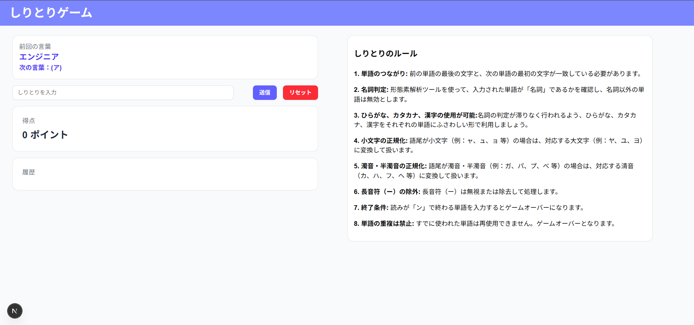

# インターン選考課題:しりとりアプリ



## 実装した機能、デザイン

### 必須要件

1. 直前の単語を、表示できるようにする
2. 任意の単語を、入力できるようにする
3. 直前の単語の末尾と、入力した単語の先頭を比較して、同じ場合だけ単語を更新する。違う場合は、エラーを表示する
4. 末尾が「ん」で終わる単語が入力されたら、ゲームを終了する
5. 過去に使用した単語が入力されたら、ゲームを終了する
6. ゲーム中や終了後に、最初からやり直せるリセット機能をつける

### 独自要件

1. 最初の単語がランダム
   1. 乱数を利用して最初の単語を決定。
   2. スタート時には、初期状態として新たなランダム単語が選ばれる。
2. 形態素分析ライブラリを用いて入力された単語が名詞かを判定
   1. [kuromoji.js](https://github.com/takuyaa/kuromoji.js)を利用して名詞判定。
   2. 一般名詞以外（動詞、形容詞、固有名詞など）はエラーとして扱い、再入力を促します。
3. ひらがな、カタカナ、漢字の使用が可能。
   1. kuromoji.js から得られるオブジェクトの一つである「読み」を使ってひらがな、カタカナ、漢字の差異を吸収することにより、ひらがな、カタカナ、漢字の入力と、しりとり判定ロジックの実装を両立。

### デザイン

1. TailwindCSS と ShadcnUI を用いて統一感のあるデザイン
   1. フォームの UI に ShadcnUI を用いることで開発時間を短縮しつつ使いやすいデザインを実現。
   2. indigo で全体のカラーを統一することで視認性の向上。
2. Reactの状態を用いることでゲーム開始前と後で動的にUIを変更

## アプリの動作確認の方法

### デプロイ先

[デプロイ先URL](https://shiritori-app-intern-vercel.vercel.app/)

### ローカル環境での動作手順

``` bash
git clone https://github.com/famichi-0135/shiritori-app-intern-vercel.git

bun install

bun add -g vercel

vercel dev

```

## 参考にした Web サイト

1. Cloudflare Document
2. Next.js Document
3. [JavaScript で配列の最後の要素を取得するもう一つの方法](https://qiita.com/kerupani129/items/64ce1e80eb8efb4c2b21)
4. [[React] Form の取り扱いについて理解する！](https://qiita.com/PenPe/items/a829efc4de14af7af3e1)
5. [Next.js14 でプレイリストアプリ作ってみた話](https://qiita.com/Kagari-hello-world/items/0ed5106d6e693e2037dd)


## AI を使用した部分

#### 1. しりとりのロジックのリファクタリング

- AI にコードを読んでもらって可読性が高いか判断してもらう、修正案の提案など。

#### 2. kuromoji.js を利用する API の作成の補助

- 型制御、エラーハンドリングの実装について：型制御がうまくいかないときに代替案を出してもらった。

#### 3. kuromoji.js を Vercel の環境で動かす手段の模索。

- vercel環境でkuromoji.jsが動かないという問題に対して改善案を複数個提案してもらった。
